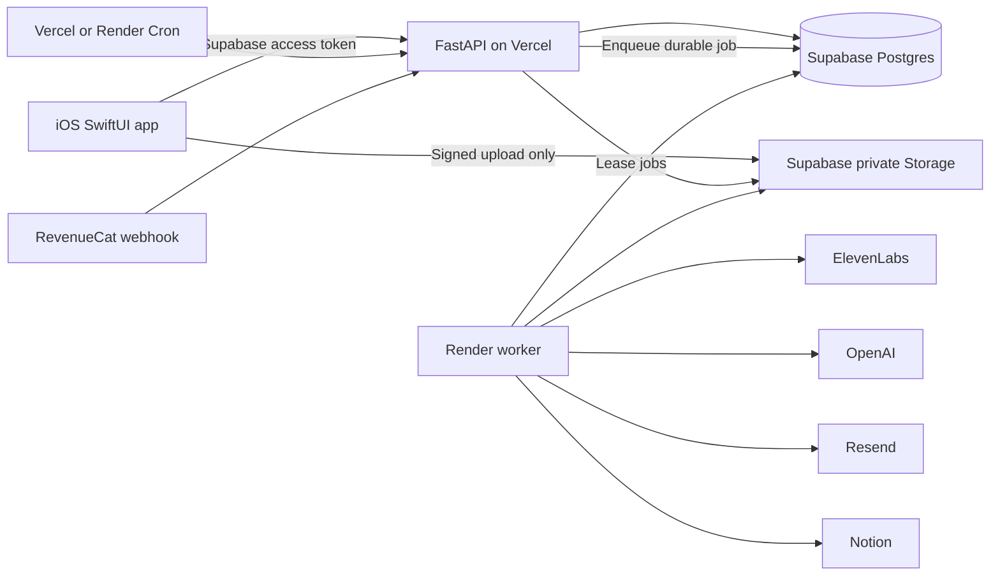

# Inkflow product, hackathon, and App Store launch plan

This is the working plan for Inkflow. It is intentionally split between the complete product we can launch and the much smaller experience we should ship for the 8x hackathon. After the product direction is accepted, durable product behavior should move into `docs/product.md` and feature packets, following the conventions in `docs/research/10x-conventions.md`.

## 1. Decision

### Is the original idea good?

Yes as a company direction, but not as a hackathon pitch in its current form.

"A reader that imports anything, reads it aloud, highlights text, makes AI notes, tracks goals, emails recaps, and exports to Notion" is useful, but it sounds like a bundle of Speechify, ElevenReader, Readwise Reader, Kindle, and Audible features. A judge cannot remember twelve features, and several mature products already cover most of them.

The existing app makes this worth pursuing because Inkflow is not starting from a slide deck. The repository already has a native reader, file import, book search, read-along narration, highlights, notes, stats, authentication, storage declarations, database migrations, and an email backend.

### What should the hackathon product be?

**Inkflow Alive: drop in any book and hear it performed by a cast while every spoken word stays synchronized with the page. Interrupt at any moment to ask a question and Inkflow saves the answer as a cited, rendered note.**

The memorable transformation is not "AI notes" or "another audiobook player." It is watching a flat EPUB become a live, multi-character performance in seconds.

The complete Inkflow company remains the universal reading and memory system around that wedge:

- Bring a public-domain book, owned file, document, article link, or pasted text.
- Read, listen, or do both with one shared position.
- Use free on-device narration or premium cloud voices.
- Highlight, ask, annotate, and turn reading into durable knowledge.
- Build goals and receive useful daily or weekly recaps.
- Export owned notes and highlights to Notion and, later, other tools.

### Why this is the strongest 8x angle

The live event says to build something "useful," "weird," "beautiful," or "completely unhinged" and gives builders about six hours from kickoff to demos. The previous 8x winners were narrow, demonstrable consumer transformations:

- Ljubljana first place: scan a plushie and turn it into a communicating 3D character.
- Berlin first place: use a selfie to create a personal color palette and outfit feedback.
- London first place: turn social restaurant discovery into an AI agent that makes real calls and books the table.

Sources: [live 8x event page](https://luma.com/r9do4ap3?tk=X5hYpL), [Ljubljana winners](https://www.8x.social/en/blog/18th-july-15-judges-8x-mobile-hackathon-ljubljana), and [London winners](https://www.linkedin.com/posts/8x-human_yesterday-we-hosted-the-first-8x-mobile-activity-7471896753684783104-DuKT).

Those results favor one obvious before-and-after moment on a real phone. Inkflow Alive provides that moment while reusing the strongest parts of the current app.

## 2. Current repository audit

The requested Git remote is already configured:

```text
origin https://github.com/Karan-Palan/inkflow-76b146
```

`origin/main` contains the 10x initial scaffold. The local `main` branch was reinitialized without a local commit and the working tree contains the scaffold as untracked files. Re-cloning into this directory would overwrite current work, so the repository should be preserved and normalized only when the first intentional baseline commit is made.

There was no root `PLAN.md` before this file. The earlier plan is `idea/plan.md`; the older Vercel and hackathon drafts are correctly marked superseded under `docs/research/superseded/`.

### What is already implemented

| Area | Existing implementation | Assessment |
|---|---|---|
| iOS shell | SwiftUI app, iOS 26 target, native navigation, Paper and Ink theme | Keep |
| Onboarding | Five-screen product-led flow with synchronized reader proof, sources, read/listen preferences, goal, genre, and direct launch | Current hackathon flow; no auth or paywall gate |
| Authentication | 10x auth code remains available but is bypassed at launch | Intentionally deferred until the product loop is stable |
| Library | Local SwiftData library, search, shelves, downloads, backups | Strong base |
| Discovery | Gutenberg and Internet Archive search with Open Library covers | Keep, but enforce public-domain and downloadable availability rules |
| Import | EPUB, PDF, DOCX, RTF, TXT, Markdown, pasted text, public document links, and article extraction | Add hostile-file tests, OCR, and Share Extension |
| Reading | TextKit reader, EPUB WebView, PDFKit reader, themes, fonts, table of contents | Strong base; needs a canonical locator model |
| Listening | `AVSpeechSynthesizer`, Audible-style player, speed, sleep timer, read-along ranges | Keep as the free and offline engine |
| Annotation | Highlights, notes, chapter/book extractive summaries, Markdown thoughts and rich preview | Add AI citations, provenance, and reliable cross-format anchors |
| Goals | Reading sessions, daily goal, streak, stats | Keep and sync |
| Email | FastAPI digest routes, OpenAI note generation, Resend support, scheduled job | Real but incomplete; weekly digest and production delivery remain |
| Database | Neon migrations for library, highlights, notes, sessions, goals, and digests with owner-scoped RLS | Useful staging base; production model below is broader |
| Storage | R2 buckets declared by 10x | Useful staging base |
| App Store material | Listing, privacy text, support, terms, screenshots, review notes | Draft only; must be regenerated after final product behavior |

### Important gaps and debt

- No cloud narration, word-timing manifest, cast extraction, or generation queue exists.
- Rich Markdown summaries and thoughts now work locally, but no grounded AI question route or citation model exists.
- Direct provider calls and some data work do not yet follow the 10x rule that views consume stores and stores own network access.
- The OpenAPI document covers only digest routes.
- The generated iOS client and `tenx.yaml` do not describe the full product API.
- The data model has separate digest mirrors instead of a single authoritative annotation and session model.
- No entitlement, usage ledger, StoreKit, RevenueCat, or paywall implementation exists.
- No Notion OAuth or export job exists.
- No complete test strategy, contract drift gate, privacy manifest, analytics registry, or production runbook exists.
- The current Xcode scheme contains deployment-specific preview configuration. Public client values are not secrets, but environment configuration must not be baked into a release scheme.

## 3. Product contract

### One-line promise

**Every document becomes a book you can read, hear, question, and remember.**

### Hackathon promise

**Any book becomes a synchronized, full-cast audiobook.**

### Primary user

The first target is a student or knowledge worker who already saves long material but struggles to finish and retain it. They read across books, PDFs, and articles, switch between visual and audio consumption, and care about highlights and notes more than owning another content catalog.

Secondary users:

- Readers with dyslexia, ADHD, low vision, or reading fatigue.
- Commuters who want to switch between reading and listening without losing position.
- Book readers who want a more expressive performance for owned and public-domain text.

### Jobs to be done

1. When I find a long thing worth reading, let me get it into one place in seconds.
2. When my context changes, let me continue with my eyes or ears from the same position.
3. When a passage matters, let me understand and save it without leaving the page.
4. When I stop reading, help me remember what mattered and resume without guilt.
5. When I use another knowledge tool, let me export my own thinking cleanly.

### Product principles

- The first useful action happens before the paywall.
- The page remains calm. AI is invoked, not sprayed over every paragraph.
- Reading position is one canonical state shared by visual and audio modes.
- Free on-device speech always remains available for owned text.
- Premium generation is explicit, metered, cancellable, and never silently expensive.
- User content is private by default. Public sharing is an explicit later feature.
- Notes cite the exact passage and distinguish user text from AI text.
- Documents are untrusted input. Their text never becomes system instructions.
- The iOS app remains native. Glass is used for floating controls, not behind reading content.

### Non-goals for version 1

- Selling copyrighted books or operating a general ebook store.
- Bypassing DRM or importing protected Kindle or Audible purchases.
- Hosting Internet Archive loans outside their permitted flow.
- Collaborative document editing.
- A general-purpose AI assistant or research agent.
- Android, web reading, social feeds, podcasts, video generation, or voice cloning at launch.
- Rich-text editing of the source book. Version 1 edits notes, not the imported publication.

## 4. Competitive reality and differentiation

| Capability | Speechify / ElevenReader | Readwise Reader | Kindle / Audible | Inkflow launch | Inkflow Alive |
|---|---|---|---|---|---|
| Import EPUB, PDF, text, article | Yes | Yes | Limited ecosystem | Yes | Yes |
| Read and listen in sync | Yes | TTS focus | Yes for eligible paired titles | Yes | Yes |
| Highlights and notes | Basic to moderate | Excellent | Yes | Yes | Yes |
| AI summaries and document chat | Yes | Yes | Limited | Yes, passage-first | Yes |
| Goals and digest | Limited | Daily Review | Reading insights | Yes | Yes |
| Notion export | Limited / varies | Yes | No | Yes | Yes |
| Multi-character performance for owned text | Not the core promise | No | Only published audiobook cast | No | **Core wedge** |
| Exact note citation back to imported passage | Varies | Strong | Strong in ecosystem | **Required** | **Required** |
| Offline free narration | Platform dependent | Limited | Catalog dependent | **On-device** | Fallback |

Competitive sources: [ElevenReader imports and plans](https://elevenreader.io/text-reader-app), [Readwise Reader documentation](https://docs.readwise.io/reader/docs), and [Audible Read and Listen](https://help.audible.com/s/article/listen-with-whispersync-for-voice?language=en_US).

The moat is not a checklist. The initial differentiated loop is:

```text
owned text -> character and scene understanding -> cast performance
          -> synchronized reading -> passage question -> cited note
          -> daily and weekly resurfacing -> continued reading
```

## 5. Complete launch user journey

### 5.1 First launch and onboarding

The downloaded Speechify reference sequence contains roughly 45 relevant screens. It demonstrates useful patterns, but Inkflow should not copy its length.

Use these patterns:

- One question per screen with a visible progress indicator.
- Immediate option rows with large touch targets.
- A live voice and speed audition before asking for an account.
- Save-progress authentication after the user has experienced value.
- A clear trial reminder toggle and Restore action on the paywall.

Do not copy these patterns:

- Demographic questions unrelated to product function.
- Twenty or more steps before reaching the library.
- Generic AI task menus that weaken the reading promise.
- Fake scarcity, fake testimonials, or unsupported catalog claims.

#### App Store onboarding flow

1. **Welcome**
   - Headline: "Read with your eyes. Continue with your ears."
   - Actions: Get Started, Sign In.
2. **Intent**
   - Study, work, leisure, accessibility, or finish more books.
   - Used only to personalize defaults and onboarding copy.
3. **Sources**
   - Books, PDFs and documents, articles, or pasted text.
4. **Mode**
   - Mostly read, mostly listen, or both.
5. **Goal**
   - 10, 20, 30, or 45 minutes per day. Default is 20.
6. **Voice audition**
   - Three curated voices, one short real sample, speed control.
   - No celebrity likeness or ambiguous voice rights.
7. **Alive preview**
   - A 15 to 20 second public-domain scene with narrator and character voices.
   - Text visibly follows the performance.
8. **Save progress**
   - Sign in with Apple primary, Google secondary, email tertiary.
   - A guest can continue locally, but cloud sync and trials require an account.
9. **Paywall**
   - Shown only after the Alive preview or when a premium action is selected.
   - Restore Purchases, Terms, Privacy, renewal terms, localized price, and close action are visible.
10. **Library**
   - First-run empty state offers Find a free classic, Import a file, Paste a link, and Paste text.

#### Hackathon onboarding flow

Paywall and account creation are skipped. Use at most four short screens:

1. Welcome.
2. Choose read, listen, or both.
3. Choose a voice style.
4. Open the prepared public-domain book directly into Alive mode.

The demo should also support a hidden deep link that bypasses onboarding and opens the prepared scene.

### 5.2 Main navigation

Use four native tabs:

1. **Home** - continue card, today goal, recent items, recommended public-domain works.
2. **Library** - owned and imported items, filters, search, folders later.
3. **Notebook** - highlights, notes, AI notes, export state.
4. **You** - goals, stats, digest settings, account, subscription, connectors.

Use a prominent Add action from Home and Library. The Add sheet contains:

- Search free books.
- Import file.
- Paste article link.
- Paste text.
- Scan pages, later.
- Import from a connector, later.

### 5.3 Search and acquisition

Search Open Library and Internet Archive metadata through the backend, not directly from the view. Use Open Library search for discovery and Internet Archive metadata for actual downloadable files.

Every result must resolve into one of these states:

- Public domain and downloadable: Add or Read Now.
- Borrowable on the source service: Open in source service, not copied into Inkflow.
- Metadata only: Preview details, no misleading Download button.
- Already owned: Open.

Open Library states that its API is for human-centered discovery and is not intended to be a third-party application's primary data backend. Cache responsibly, send identification, respect rate limits, and keep a provider abstraction so another catalog can be added. Source: [Open Library API guidance](https://openlibrary.org/developers/api).

### 5.4 Import

Supported at launch:

- EPUB without DRM.
- Text-based PDF.
- TXT and Markdown.
- Pasted text.
- Article link where readable content can be legally extracted.

Supported after launch:

- DOCX.
- Scanned PDF and page photos through OCR.
- iOS Share Extension.
- Email-to-Inkflow address.

Import requirements:

- Show upload, extraction, chapter detection, and ready states separately.
- Preserve the original private file until the user deletes it or selects a reduced-retention mode.
- Store normalized content in semantic blocks with stable IDs.
- Report unsupported encryption, DRM, malformed archives, size limits, and extraction failure clearly.
- Never claim an import succeeded until a first page can render.
- The same source hash is idempotent per user.

### 5.5 Book detail

The book detail screen contains:

- Cover, title, author, source, format, and rights state.
- Read or Resume.
- Listen or Resume.
- Alive Mode, marked Premium when applicable.
- Download for offline use.
- Chapter list with text, device audio, and cloud audio availability.
- Reading progress, last opened time, notes count, and estimated time remaining.
- Delete from library and delete source file as separate confirmed actions.

### 5.6 Reader

The reader is the core screen and must remain usable without the network.

Required behavior:

- Paginated and scrolling modes for reflowable text.
- System text size support plus reader font, size, line height, margins, and theme.
- Reliable table of contents and chapter navigation.
- Tap center to show or hide chrome.
- Selection toolbar: Highlight, Note, Ask, Copy, Define, Translate.
- Highlight colors carry labels, not color-only meaning.
- Notes support Markdown source and rendered preview.
- Visual reading and narration update one canonical locator.
- Closing or backgrounding flushes progress and session time.
- VoiceOver order, Dynamic Type, Reduce Motion, Reduce Transparency, and minimum 44 pt controls are verified.
- Network-dependent actions show offline state without blocking reading.

Canonical locators:

- EPUB: publication ID, spine item ID, block ID, character start, character end, and a short text quote for repair.
- Plain text / article: content version, block ID, character range, and quote.
- PDF: document fingerprint, page index, normalized rectangle, and selected text quote.

Never store only a raw global character offset for every format. It will drift after parsing or layout changes.

### 5.7 Listening and Alive mode

Two narration engines share one player contract:

1. **Device narration**
   - `AVSpeechSynthesizer`.
   - Free, offline, unlimited, and lower quality.
   - Uses delegate ranges for approximate read-along highlighting.
2. **Cloud narration**
   - ElevenLabs through the backend only.
   - Premium, metered, cached, downloadable, and higher quality.
   - Uses provider timestamps or forced alignment for exact synchronization.

Alive mode adds:

- Character extraction with narrator and speaker labels.
- A deterministic voice assignment per work and language.
- Multi-speaker dialogue generation by scene or bounded chunk.
- Word timing manifest linked back to semantic block IDs.
- Seamless fallback to a single cloud narrator if cast confidence is low.
- Seamless fallback to device narration if cloud audio is unavailable.

ElevenLabs officially supports multi-speaker Text to Dialogue and provides Forced Alignment specifically for matching audiobook audio to ebook text. Text to Dialogue should be chunked below its documented reliable request size, and audio should be generated ahead of playback rather than in one book-sized request. Sources: [Text to Dialogue](https://elevenlabs.io/docs/overview/capabilities/text-to-dialogue) and [Forced Alignment](https://elevenlabs.io/docs/overview/capabilities/forced-alignment).

Player requirements:

- Mini player above the tab bar.
- Expanded Audible-style player with cover, chapter, timeline, 15-second skip, speed, voice, sleep timer, and chapters.
- Read Along action opens the exact current passage.
- Listen Only action keeps playing with the screen locked.
- `MPNowPlayingInfoCenter`, remote controls, interruptions, route changes, and AirPods events.
- Downloads show size and removal action.
- Playback never waits for the entire book to generate.

### 5.8 Ask, highlights, and notes

Ask is passage-first, not an ungrounded general chat.

Flow:

1. Select a passage or open Ask from the current page.
2. Choose Explain, Summarize, Connect, Quiz Me, or enter a question.
3. The backend receives the selected passage, a bounded surrounding context window, document metadata, and user question.
4. The response returns Markdown plus citations to block IDs and quote snippets.
5. The user can Save to Notebook, Copy, Regenerate, or discard.

Every note stores:

- User-authored or AI-authored origin.
- Exact source locator and quoted passage.
- Markdown source and a sanitized rendered representation.
- Model and prompt version for AI notes.
- Created, updated, and deleted timestamps.

AI output must never silently edit a user's note. Editing an AI note creates a user-edited revision.

### 5.9 Goals, stats, and recaps

Goals:

- Daily minutes.
- Weekly minutes.
- Books per year, after launch.

Stats:

- Read minutes, listened minutes, and overlap minutes.
- Pages or normalized word-equivalent, clearly labeled as an estimate.
- Current and longest streak.
- Goal completion calendar.
- Finished books.

Do not double count simultaneous reading and listening as two separate minutes.

Daily email:

- Sent only when explicitly enabled.
- Shows yesterday's minutes, book, last position, saved highlights, and one Resume action.
- If a goal was missed, use neutral language. No shame-based copy.
- If nothing happened, send only when the user opted into reminders.

Weekly email:

- Books and chapters touched.
- Read versus listened time.
- Goal and streak summary.
- Top user highlights.
- AI-generated key points that cite the originating passages.
- Open Notebook and Resume actions.

Every email includes unsubscribe and preference management. Delivery, bounce, suppression, and complaint events are stored.

### 5.10 Notion export

OAuth occurs on the backend. The iOS app receives only connection status, never the Notion access token.

User flow:

1. Connect Notion from You or Notebook.
2. Authorize a workspace and select a destination page or database.
3. Export one note, one book notebook, or all new notes.
4. Show queued, exported, partially exported, or failed state.
5. Retrying uses the same idempotency key and never duplicates a page.

Exported page structure:

- Book title and author.
- Source metadata and Inkflow deep link.
- Chapter headings.
- Quoted highlights as quote blocks.
- User notes as regular blocks.
- AI notes labeled "AI-assisted" with source citations.
- Export timestamp and stable Inkflow IDs for updates.

The Notion API supports OAuth, page creation, and appending blocks. Sources: [Notion authorization](https://developers.notion.com/guides/get-started/authorization) and [create a page](https://developers.notion.com/reference/post-page).

### 5.11 Account, subscription, and deletion

Account features:

- Sign in with Apple, Google, and email.
- Restore Purchases.
- Manage subscription.
- Export user data.
- Disconnect Notion.
- Sign out.
- Delete account inside the app.

Deletion flow:

1. Explain what will be deleted and what billing action is separate.
2. Reauthenticate for a destructive request.
3. Revoke connectors and scheduled mail.
4. Queue deletion of private files, normalized content, audio, notes, sessions, and profile.
5. Retain only legally required billing and abuse records, documented by category and duration.
6. Confirm completion by email if the user still permits transactional delivery.

Apple requires in-app account deletion for apps that support account creation. Reader apps and digital subscriptions must also follow the current purchase and account-link rules. Sources: [Apple account deletion](https://developer.apple.com/support/offering-account-deletion-in-your-app/) and [App Review Guidelines](https://developer.apple.com/app-store/review/guidelines/).

## 6. Screen inventory and states

| ID | Screen / surface | Launch | Hackathon | Required states |
|---|---|---:|---:|---|
| S01 | Splash and session restore | Yes | Yes | loading, auth expired, offline |
| S02-S09 | Onboarding steps | Yes | Trimmed | selected, disabled, back, resume |
| S10 | Sign in / save progress | Yes | No | loading, provider error, cancellation |
| S11 | Paywall | Yes | No | eligible trial, no trial, purchasing, restored, error |
| S12 | Home | Yes | Yes | first run, active reader, offline, sync error |
| S13 | Library | Yes | Yes | empty, populated, filtered, downloading |
| S14 | Add source sheet | Yes | Yes | source availability, permission errors |
| S15 | Search | Yes | Yes | idle, loading, results, no results, rate limited, error |
| S16 | Import progress | Yes | Short | uploading, extracting, ready, unsupported, failed |
| S17 | Book detail | Yes | Yes | local, remote, generating, offline |
| S18 | Reader | Yes | Yes | chrome shown/hidden, selection, offline, sync conflict |
| S19 | Mini player | Yes | Yes | loading, playing, paused, buffering, error |
| S20 | Expanded player | Yes | Yes | device voice, cloud voice, cast, download |
| S21 | Voice and cast picker | Yes | Yes | previewing, selected, unavailable |
| S22 | Ask sheet | Yes | Yes | composer, generating, answer, safety error, offline |
| S23 | Note editor and preview | Yes | Yes | dirty, saving, conflict, rendered |
| S24 | Notebook | Yes | Yes | empty, filtered, search, exporting |
| S25 | Goals and stats | Yes | Existing | empty week, active week, edit goal |
| S26 | Digest preferences | Yes | Existing | disabled, enabled, verifying email, error |
| S27 | Notion connection | Yes | No | disconnected, authorizing, connected, revoked |
| S28 | Subscription settings | Yes | No | free, trial, paid, grace period, expired |
| S29 | Account and privacy | Yes | No | export requested, deletion pending, failure |

## 7. Architecture decision

### 7.1 Do not re-platform during the hackathon

The current 10x project already declares:

- Neon Postgres.
- 10x managed Better Auth.
- R2 private storage.
- A Python FastAPI backend.
- Scheduled jobs.
- Generated iOS auth, data, storage, and backend facades.

Use that existing staging environment for the hackathon. Replacing auth, database, storage, and deployment on demo day creates risk without improving the pitch.

### 7.2 Production target

For TestFlight and the App Store, follow the verified 10x monorepo conventions the user requested:

- Native SwiftUI iOS app.
- FastAPI and pinned Pydantic on Vercel for short HTTP control-plane requests.
- Supabase Auth, Postgres, and private Storage.
- A durable Postgres job table.
- A long-lived worker on Render for extraction, cloud narration, AI note jobs, exports, and digest batches.
- Vercel Cron for short dispatch and health tasks, or Render Cron for worker-owned schedules.
- Resend for transactional email.
- RevenueCat as the subscription state aggregator over StoreKit 2.
- PostHog with a registered event contract and privacy allowlist.

This is not a second permanent stack. It is a controlled cutover from the 10x hackathon environment to the launch environment.



### 7.3 Boundary rules

- Views render state and dispatch intent. They never perform network requests.
- Per-surface `@Observable` stores call API and local repository abstractions.
- The app target is thin. Reusable code belongs in a `InkflowKit` Swift package.
- The backend is router -> schema -> service -> persistence/provider.
- The API owns authorization and user scoping even when RLS is also enabled.
- The iOS client never receives service-role, OpenAI, ElevenLabs, Resend, Notion, or RevenueCat secret keys.
- All provider calls are behind small service modules and mocked by default in tests.
- Long work is a durable job. A Vercel request only validates, stores, enqueues, and returns.
- Generated contracts identify their source and generator and are never hand-edited.
- Cross-project serialized data has one schema owner.
- Database changes use expand, migrate, contract.

### 7.4 Environments and deployment units

| Environment | iOS | API | Data / files | Worker | Purpose |
|---|---|---|---|---|---|
| Local | Simulator | localhost FastAPI | local Supabase or isolated project | local worker | Development and tests |
| Hackathon | Ad hoc build | 10x backend | 10x Neon / R2 | 10x job runner | Same-day demo only |
| Staging | TestFlight internal | Vercel preview/staging alias | Supabase staging | Render staging | Integration and review |
| Production | App Store | Vercel production alias | Supabase production | Render production | Real users |

No development build may default to production. Provider live tests are opt-in and spend-capped.

## 8. Recommended repository layout

Adopt the 10x structure progressively. Do not spend hackathon time moving thousands of lines.

```text
Inkflow/
  AGENTS.md
  CLAUDE.md
  CONTRIBUTING.md
  SECURITY.md
  PLAN.md
  README.md
  tenx.yaml
  docs/
    README.md
    product.md
    architecture.md
    api-and-contracts.md
    security-and-privacy.md
    testing-strategy.md
    deployment-and-releases.md
    design/
    features/
    adr/
    runbooks/
    research/
  backend/
    app.py
    vercel.json
    requirements.txt
    requirements-dev.txt
    api/
      main.py
      config.py
      dependencies.py
      routers/
      schemas/
      services/
      generated/
    shared/
    supabase/migrations/
    scripts/
    tests/
    docs/
  contracts/
    openapi/
    analytics-events/
    fixtures/
  packages/
    design-tokens/
  ios/
    App/
    Sources/InkflowKit/
      API/
      Audio/
      Import/
      Models/
      Persistence/
      Theme/
      Primitives/
      Mocks/
      Views/
    Tests/InkflowKitTests/
    docs/
  services/
  scripts/
  growth/
  release/
```

Immediate structural changes after the hackathon:

1. Add canonical root and subtree instructions.
2. Move SQL migrations to the backend Supabase migration source of truth.
3. Add `contracts/openapi/product-api.json` generated from FastAPI.
4. Create a thin iOS app target plus local `InkflowKit` package.
5. Move theme values to generated design tokens only after two consumers exist or token drift becomes a real problem.
6. Add root `scripts/bootstrap`, `scripts/dev`, `scripts/test`, `scripts/check`, and `scripts/affected` wrappers.

## 9. Data model

Use UUID primary keys, `created_at`, `updated_at`, and explicit deletion state where sync requires tombstones. All user-owned tables carry `owner_id uuid references auth.users(id) on delete cascade` and enable RLS. The service role still scopes every query.

### 9.1 Identity and preferences

| Table | Important fields | Notes |
|---|---|---|
| `profiles` | `owner_id`, `display_name`, `timezone`, `locale`, `onboarding_version`, `deleted_at` | One row per user |
| `reader_preferences` | `owner_id`, `theme`, `font`, `font_scale`, `line_height`, `pagination_mode`, `default_speed`, `default_voice_id` | Synced settings |
| `notification_preferences` | `owner_id`, `daily_enabled`, `weekly_enabled`, `reminder_enabled`, `send_hour_local`, `email_verified_at` | Consent source of truth |

### 9.2 Content and library

| Table | Important fields | Notes |
|---|---|---|
| `works` | `id`, `visibility`, `rights_status`, `source_provider`, `source_ref`, `content_hash`, `title`, `author`, `language`, `cover_key` | Shared only for verified public-domain content; otherwise owner-scoped |
| `work_owners` | `work_id`, `owner_id`, `original_file_key`, `import_source`, `retention_mode` | Separates shared work metadata from a user's file |
| `content_versions` | `id`, `work_id`, `parser_version`, `source_hash`, `status`, `block_count`, `word_count` | Immutable normalized version |
| `chapters` | `id`, `content_version_id`, `ordinal`, `title`, `first_block_ordinal`, `last_block_ordinal` | Unique ordinal per version |
| `content_blocks` | `id`, `content_version_id`, `chapter_id`, `ordinal`, `kind`, `plain_text`, `source_locator jsonb` | Stable semantic unit for citations and sync |
| `library_items` | `id`, `owner_id`, `work_id`, `active_content_version_id`, `state`, `added_at`, `last_opened_at`, `finished_at` | User's relationship to a work |
| `reading_positions` | `library_item_id`, `owner_id`, `locator jsonb`, `progress_fraction`, `audio_seconds`, `device_id`, `revision` | One server position with conflict metadata |
| `offline_assets` | `id`, `owner_id`, `library_item_id`, `asset_kind`, `object_key`, `bytes`, `expires_at` | Optional server record for downloads |

`rights_status` values:

- `public_domain_verified`
- `user_owned_private`
- `licensed`
- `metadata_only`
- `borrow_external`
- `unknown_restricted`

Only the first three may be processed into stored cloud narration. Unknown or restricted items never show a Download or Generate action.

### 9.3 Narration and jobs

| Table | Important fields | Notes |
|---|---|---|
| `voice_profiles` | `id`, `provider`, `provider_voice_id`, `name`, `language`, `style`, `rights_metadata`, `active` | Server-owned catalog, no raw secret |
| `work_cast` | `id`, `work_id`, `character_key`, `display_name`, `voice_profile_id`, `confidence`, `cast_version` | Stable assignment per work |
| `narration_assets` | `id`, `work_id`, `content_version_id`, `chapter_id`, `mode`, `voice_profile_id`, `cast_version`, `status`, `audio_key`, `duration_ms`, `cost_micros`, `generation_version` | Device audio is not stored here |
| `word_timings` | `narration_asset_id`, `block_id`, `token_ordinal`, `start_ms`, `end_ms`, `text` | Partition or store as compressed manifest if scale demands |
| `generation_jobs` | `id`, `owner_id`, `kind`, `resource_type`, `resource_id`, `idempotency_key`, `status`, `priority`, `attempts`, `lease_owner`, `lease_expires_at`, `next_attempt_at`, `last_error_code` | Durable worker queue |
| `usage_ledger` | `id`, `owner_id`, `kind`, `quantity`, `unit`, `provider_cost_micros`, `resource_id`, `occurred_at` | Append-only metering |
| `usage_periods` | `owner_id`, `period_start`, `cloud_audio_seconds`, `ai_tokens`, `exports`, `limit_snapshot jsonb` | Fast entitlement checks |

Never use mutable provider output as the only copy of a timing manifest. Store the normalized artifact version used by the client.

### 9.4 Reading knowledge and goals

| Table | Important fields | Notes |
|---|---|---|
| `annotations` | `id`, `owner_id`, `library_item_id`, `content_version_id`, `kind`, `locator jsonb`, `quote`, `color`, `created_at`, `deleted_at`, `revision` | Highlight and bookmark source of truth |
| `notes` | `id`, `owner_id`, `library_item_id`, `annotation_id`, `origin`, `markdown`, `render_version`, `model_id`, `prompt_version`, `created_at`, `updated_at`, `deleted_at`, `revision` | User and AI notes |
| `note_citations` | `note_id`, `block_id`, `locator jsonb`, `quote`, `ordinal` | Grounding and export |
| `reading_sessions` | `id`, `owner_id`, `library_item_id`, `started_at`, `ended_at`, `read_seconds`, `listen_seconds`, `overlap_seconds`, `start_locator`, `end_locator`, `device_id` | Server-calculated totals |
| `reading_goals` | `id`, `owner_id`, `kind`, `target`, `period`, `starts_on`, `active` | Supports future goal types |
| `goal_progress_daily` | `owner_id`, `local_date`, `read_seconds`, `listen_seconds`, `overlap_seconds`, `goal_met` | Derived and rebuildable |

### 9.5 Billing, email, and connectors

| Table | Important fields | Notes |
|---|---|---|
| `entitlements` | `owner_id`, `product`, `status`, `source`, `store_product_id`, `expires_at`, `will_renew`, `environment`, `updated_at` | Derived from verified webhooks |
| `billing_events` | `provider_event_id`, `owner_id`, `type`, `environment`, `payload_hash`, `processed_at` | Idempotent webhook log, no unnecessary full payload |
| `digest_runs` | `id`, `owner_id`, `kind`, `period_start`, `period_end`, `status`, `content_version`, `provider_message_id`, `sent_at` | One digest per user and period |
| `email_events` | `provider_event_id`, `digest_run_id`, `type`, `occurred_at` | Delivery and suppression facts |
| `connector_accounts` | `id`, `owner_id`, `provider`, `external_workspace_id`, `display_name`, `encrypted_token`, `scopes`, `status`, `connected_at`, `revoked_at` | Token encrypted with server-managed key |
| `export_jobs` | `id`, `owner_id`, `connector_account_id`, `scope`, `resource_id`, `idempotency_key`, `status`, `external_page_id`, `last_error_code` | Durable and retryable |

### 9.6 RLS and deletion rules

- A user can select, insert, update, and delete only rows with their own `owner_id`.
- Shared public-domain works are readable by authenticated users but writable only by the backend.
- Child policies verify both child ownership and parent ownership.
- Provider callbacks use a narrowly scoped backend role, never the anon key.
- Private Storage objects are addressed by unguessable keys and returned through short-lived signed URLs.
- Deleting a library item does not delete a shared public-domain work.
- Deleting the last private owner queues object and normalized-content deletion.
- Usage and billing records follow documented legal retention instead of cascading blindly.

## 10. API surface

All product endpoints are versioned under `/api/v1`. Every mutation accepts or derives an idempotency key. Every list uses cursor pagination with a default page size of 50.

### 10.1 System

| Method | Path | Purpose |
|---|---|---|
| GET | `/healthz` | Liveness only |
| GET | `/readyz` | Database and required dependency readiness |
| GET | `/api/v1/config` | Public feature flags, limits, minimum client version |

### 10.2 Profile and onboarding

| Method | Path | Purpose |
|---|---|---|
| GET | `/api/v1/me` | Profile, preferences, entitlement summary |
| PATCH | `/api/v1/me` | Update safe profile fields |
| PUT | `/api/v1/me/onboarding` | Save versioned onboarding answers |
| POST | `/api/v1/me/export` | Queue user data export |
| DELETE | `/api/v1/me` | Queue authenticated account deletion |

### 10.3 Search, import, and library

| Method | Path | Purpose |
|---|---|---|
| GET | `/api/v1/catalog/search` | Unified metadata search with availability state |
| GET | `/api/v1/catalog/works/{source}/{ref}` | Resolve source metadata and rights state |
| POST | `/api/v1/imports/file` | Create signed upload intent and import record |
| POST | `/api/v1/imports/file/{id}/complete` | Verify upload and enqueue extraction |
| POST | `/api/v1/imports/link` | Validate URL and enqueue safe article extraction |
| POST | `/api/v1/imports/text` | Store pasted text and enqueue normalization |
| GET | `/api/v1/imports/{id}` | Import and extraction state |
| GET | `/api/v1/library` | Cursor-paginated user library |
| POST | `/api/v1/library` | Add an allowed catalog work |
| GET | `/api/v1/library/{id}` | Detail, chapters, positions, asset states |
| PATCH | `/api/v1/library/{id}` | Archive, finish, or metadata overrides |
| DELETE | `/api/v1/library/{id}` | Remove user item and optionally source file |

### 10.4 Reading, annotations, and notes

| Method | Path | Purpose |
|---|---|---|
| GET | `/api/v1/library/{id}/content` | Chapter or block window for current version |
| PUT | `/api/v1/library/{id}/position` | Revision-aware canonical position update |
| POST | `/api/v1/reading-sessions` | Start or resume a server session |
| PATCH | `/api/v1/reading-sessions/{id}` | Heartbeat and bounded counters |
| POST | `/api/v1/reading-sessions/{id}/finish` | Close and aggregate session |
| GET | `/api/v1/annotations` | Filter by library item, kind, or date |
| POST | `/api/v1/annotations` | Create highlight or bookmark |
| PATCH | `/api/v1/annotations/{id}` | Update color or repaired locator |
| DELETE | `/api/v1/annotations/{id}` | Tombstone for sync |
| GET | `/api/v1/notes` | Notebook feed and search |
| POST | `/api/v1/notes` | Create a user note |
| PATCH | `/api/v1/notes/{id}` | Revision-aware update |
| DELETE | `/api/v1/notes/{id}` | Tombstone |
| POST | `/api/v1/notes/ask` | Queue or stream a grounded answer |

### 10.5 Narration

| Method | Path | Purpose |
|---|---|---|
| GET | `/api/v1/voices` | Curated entitled voice catalog |
| GET | `/api/v1/library/{id}/cast` | Current cast and confidence |
| PUT | `/api/v1/library/{id}/cast` | User overrides voice assignments |
| POST | `/api/v1/library/{id}/narrations` | Enqueue chapter or bounded range generation |
| GET | `/api/v1/narrations/{id}` | Status, duration, cost class, signed manifest URL |
| POST | `/api/v1/narrations/{id}/refresh-url` | Refresh expired signed asset URLs |
| DELETE | `/api/v1/narrations/{id}/download` | Remove user-specific offline copy record |

### 10.6 Goals, digest, and exports

| Method | Path | Purpose |
|---|---|---|
| GET | `/api/v1/stats` | Aggregated date range stats |
| GET | `/api/v1/goals` | Active goals and current progress |
| PUT | `/api/v1/goals/{kind}` | Upsert a goal |
| GET | `/api/v1/digests/preferences` | Email consent and schedule |
| PUT | `/api/v1/digests/preferences` | Update consent and schedule |
| POST | `/api/v1/digests/preview` | Send or render one explicitly requested preview |
| POST | `/api/v1/connectors/notion/authorize` | Return OAuth authorization URL |
| GET | `/api/v1/connectors/notion/callback` | Exchange code and finalize connection |
| DELETE | `/api/v1/connectors/notion` | Revoke and delete token |
| POST | `/api/v1/exports/notion` | Queue idempotent export |
| GET | `/api/v1/exports/{id}` | Export status and external URL |

### 10.7 Billing and provider callbacks

| Method | Path | Purpose |
|---|---|---|
| GET | `/api/v1/entitlements` | Server-authoritative access and usage |
| POST | `/api/v1/webhooks/revenuecat` | Verify and process subscription facts |
| POST | `/api/v1/webhooks/resend` | Verify delivery, bounce, complaint facts |

## 11. Processing and generation pipelines

### 11.1 Import state machine

```text
created -> uploading -> uploaded -> extracting -> normalizing -> ready
                                  \-> unsupported
                                  \-> failed_retryable -> extracting
                                  \-> failed_terminal
```

Extraction is deterministic code first:

- EPUB: unzip with file-count, expanded-size, and path traversal limits; parse OPF and navigation; sanitize HTML.
- PDF: use text layer when present; OCR is an explicit later fallback.
- Article: fetch through an SSRF-safe service, enforce content type and size, then readability extraction.
- Text: normalize Unicode, line endings, headings, and paragraphs.

The LLM may suggest chapter titles or repair ambiguous structure, but it never replaces deterministic extraction silently.

### 11.2 Alive generation state machine

```text
requested -> entitlement_checked -> cast_extracting -> cast_ready
          -> audio_generating -> aligning -> packaging -> ready
          \-> fallback_single_voice
          \-> failed_retryable -> queued
          \-> failed_terminal
```

Generation unit:

- At most one scene or a bounded block range.
- At most the provider's reliable character limit.
- Stable `generation_version`, `content_version_id`, `cast_version`, and seed.
- Hash-based deduplication for verified public-domain text.
- Private imports are never deduplicated across users by revealing existence or metadata.

Prefetch policy:

- Generate the first scene only when the user explicitly starts Alive mode.
- When playback begins, enqueue the next two chunks.
- Pause prefetch when playback stops for more than a bounded period.
- Do not generate an entire book by default.
- Let the user explicitly Download Full Chapter with a cost or allowance warning.

### 11.3 Job lease behavior

- Claim with `FOR UPDATE SKIP LOCKED` or an atomic RPC.
- Record lease owner and expiry.
- Heartbeat long provider calls.
- Use exponential backoff with jitter and a maximum attempt count by error class.
- Treat validation, rights, and entitlement errors as terminal.
- Treat rate limit and provider outage as retryable.
- Provider request idempotency and output hashes prevent duplicate charges where supported.
- A dead-letter state retains safe metadata, never raw book content in logs.

## 12. iOS implementation plan

### 12.1 Core abstractions

```text
AppCoordinator
  |- OnboardingStore
  |- HomeStore
  |- LibraryStore
  |- ReaderStore
  |- PlayerStore
  |- NotebookStore
  |- StatsStore
  |- AccountStore

ReaderStore
  |- LocalLibraryRepository
  |- SyncRepository
  |- ContentRepository
  |- AnnotationRepository
  |- NarrationCoordinator

NarrationCoordinator
  |- DeviceNarrationEngine
  |- CloudNarrationEngine
  |- AudioDownloadManager
  |- TimingManifestIndex
```

Required refactors:

- Turn `SpeechReader` into a `NarrationEngine` implementation rather than a global view dependency.
- Move book search and download calls behind `LibraryStore` and `CatalogClient`.
- Introduce a shared `PublicationLocator` model for text, EPUB, and PDF.
- Keep SwiftData as the offline cache and outbox, not an independent source of truth.
- Add sync revisions, tombstones, retry state, and conflict rules.
- Move EPUB script messages through a typed bridge and validate every decoded value.
- Replace static backend URL fallbacks with build configuration and fail closed in release builds.

### 12.2 Offline and sync behavior

- Local creation receives a client UUID and enters the outbox.
- Sync batches mutations in causal order.
- Progress uses highest confirmed forward position unless the user explicitly seeks backward and confirms a new session.
- Notes and highlights use revision checks. Concurrent edits produce a recoverable conflict copy, never silent last-write loss.
- Deletes create tombstones until every known device has had a reasonable sync window.
- Audio files are optional cached assets with checksums and resumable downloads.
- Sign out removes access tokens and private decrypted caches according to the user's Keep Downloads choice.

### 12.3 Design system

Keep the current Paper and Ink direction, then map it into 10x-style tokens:

- 2, 4, 8, 12, 16, 24, 32 spacing grid.
- Minimum 44 pt touch targets.
- Content on opaque paper surfaces.
- Glass only for floating navigation and player chrome.
- Reader themes have explicit light, sepia, dark, and high-contrast variants.
- Semantic color names only: surface, text primary, text secondary, accent, success, warning, error, separator, highlight yellow/blue/green/pink.
- Use native typography with Dynamic Type. Decorative serif is optional for titles, never required for body accessibility.

Every screen must be verified at iPhone SE width, current Pro width, iPad split width if iPad remains supported, light, dark, keyboard shown, VoiceOver, and large text.

## 13. Security, privacy, and content rights

### 13.1 Threats to handle before launch

- SSRF from pasted URLs: allow only HTTP(S), resolve DNS, block private and link-local ranges, cap redirects, bytes, and time.
- Zip bombs and path traversal in EPUB/DOCX: cap entries, compression ratio, expanded bytes, and normalized paths.
- Malicious PDF and HTML: parse in an isolated worker, sanitize markup, never execute embedded scripts.
- Prompt injection from document text: wrap content as untrusted data, separate system instructions, and restrict tools.
- Broken object authorization: derive owner from verified token and scope every resource lookup.
- Signed URL leakage: short TTL, private buckets, no query strings in analytics or logs.
- Connector theft: encrypt Notion tokens, limit scopes, revoke on disconnect or account deletion.
- Cost abuse: server-side entitlements, per-user and per-IP limits, daily spend caps, idempotency, and anomaly alerts.
- Voice rights: only licensed provider voices and explicit metadata. No unauthorized celebrity or user voice cloning.

### 13.2 Privacy promises

- Private reading content is not used to train Inkflow models.
- Send only the minimum bounded context required for the requested AI action.
- Give users a cloud processing disclosure before first premium generation.
- Offer delete-original and reduced-retention choices after extraction.
- Do not put book titles, passages, questions, notes, email addresses, or connector page names in analytics.
- Logs contain resource IDs, stable error codes, duration, size class, and provider, not content.
- Privacy policy and App Store privacy labels must match actual SDK and provider behavior.

### 13.3 Copyright and catalog rules

- Generate shared audio only for verified public-domain or licensed works.
- User uploads remain private and are processed on the user's instruction.
- Do not bypass DRM.
- Do not label every Internet Archive result as downloadable.
- Deep-link externally for borrow-only or restricted works.
- Keep source provider, identifier, rights status, and retrieval date for every catalog item.
- Replace scraped commercial cover art in marketing surfaces unless its use is licensed or clearly permitted.
- Provide a copyright complaint contact and takedown process before public sharing exists.

## 14. Monetization and unit economics

### 14.1 The old unlimited plan is not viable

Current ElevenLabs API pricing lists v3 text-to-speech at roughly $0.10 per generated minute. A 10-hour book can therefore cost around $60 for narration alone. This excludes Apple commission, storage, bandwidth, LLM work, email, support, failed generations, and taxes. Source: [ElevenLabs API pricing](https://elevenlabs.io/pricing/api).

Therefore:

- Do not promise unlimited premium cloud narration at INR 499 or INR 699 per month.
- Do not pre-generate an entire private book automatically.
- Do not use startup credits as the production business model.

### 14.2 Recommended tiers

Exact localized prices require App Store testing and a live cost model. Initial structure:

**Free**

- Unlimited local reading.
- Unlimited on-device narration.
- Public-domain catalog search and owned imports.
- Highlights, user notes, local goals.
- A small one-time Alive sample.

**Pro subscription**

- Sync across devices.
- AI passage questions and weekly recap.
- Notion export.
- A clearly stated monthly allowance of cloud narration or Alive minutes.
- Discounted additional minute packs.
- Access to already-cached public-domain performances without charging generation cost again.

**Cloud minute packs**

- Consumable StoreKit products for additional generation.
- The purchase screen shows minutes, voice class, and whether regeneration consumes allowance.
- Server ledger and RevenueCat entitlement state prevent replay or double credit.

Possible launch experiment, not a committed price:

- Pro: INR 699 to INR 999 per month or a strong annual discount.
- Included premium generation: set only after measuring actual provider cost and Apple net proceeds.
- A conservative starting allowance should target provider gross margin above 70 percent.

### 14.3 Cost controls

- On-device speech is the default for long-form listening.
- Use premium full-cast generation for selected scenes and chapters.
- Cache verified public-domain audio once across users.
- Generate ahead by two chunks, not the whole book.
- Track provider cost per asset in micro-units.
- Expose allowance before generation.
- Stop work immediately when entitlement or spend cap changes.
- Apply for the ElevenLabs startup grant, but model the business at list price.

## 15. Analytics and success metrics

### North-star metric

**Weekly retained reading hours with at least one meaningful interaction** such as a saved highlight, note, question, or mode switch.

Listening minutes alone can be passive and are not enough to prove the product helps users read and remember.

### Activation

- Completed first import or opened first catalog book.
- Reached first visible page.
- Played at least 30 seconds.
- Switched between read and listen.
- Saved first highlight or note.
- Returned within seven days.

### Product metrics

- Import success rate by format.
- Time from add action to first readable page.
- Time from Alive request to first audio byte.
- Narration start success, buffering ratio, and alignment error reports.
- Read/listen switch rate.
- Notes saved per active reader.
- Daily and weekly digest open and resume rates.
- Trial start, trial-to-paid, renewal, and restore success.
- Provider cost per activated user and per retained hour.

### Event contract examples

```text
onboarding_step_completed
source_add_started
source_add_completed
source_add_failed
reader_opened
narration_started
narration_mode_changed
alive_generation_requested
alive_generation_ready
annotation_created
ai_note_saved
reading_session_completed
goal_updated
digest_preference_updated
notion_export_completed
paywall_viewed
purchase_completed
```

Properties are allowlisted and never include raw text, titles, URLs, notes, questions, emails, or provider tokens.

## 16. Testing and verification

### Backend

- Router tests with authenticated dependency overrides.
- Service tests with provider modules mocked.
- Migration tests for constraints, RLS, deletion, and idempotency.
- OpenAPI export and compatibility tests.
- Parser fixtures for valid, malformed, encrypted, oversized, and hostile inputs.
- Job lease, retry, expiry, duplicate delivery, and dead-letter tests.
- Webhook signature and replay tests.
- Cost and entitlement boundary tests.

### iOS

- Unit tests for locators, pagination, sync merge, outbox, session math, and timing lookup.
- Mock transport tests for every screen state.
- Fixture parity tests against API response shapes.
- Snapshot tests for solid-content screens.
- Visual verification for glass and audio surfaces.
- UI tests for onboarding, import, read, listen, ask, note, restore purchase, and delete account.
- Accessibility labels, VoiceOver order, Dynamic Type, Reduce Motion, and reduced-transparency checks.
- Background audio, interruptions, route changes, lock screen, and offline tests on a real device.

### End-to-end launch paths

1. New user -> onboarding -> sample -> sign in -> paywall -> restore -> library.
2. Import EPUB -> render -> highlight -> note -> sync -> reopen on second device.
3. Search public-domain book -> add -> read -> device narration -> mode switch.
4. Request Alive -> job -> cast -> audio -> word sync -> offline download.
5. Ask passage -> cited Markdown note -> Notion export.
6. Finish session -> stats -> daily digest -> resume deep link.
7. Delete account -> revoke connector -> remove private objects -> verify access denied.

No mock-only path counts as production end-to-end evidence.

## 17. Observability and operations

- Correlation ID from iOS request through API, job, provider call, and webhook.
- Stable error code catalog with safe user messages.
- Metrics for request latency, queue depth, job age, provider latency, provider error class, generation cost, email delivery, and import failures.
- Alert on stuck jobs, queue oldest age, spend cap, entitlement webhook lag, email complaint spike, and storage deletion failures.
- Health endpoints separate liveness from readiness.
- Provider outages degrade to device narration and local reading.
- Vercel rollback promotes the previous immutable deployment.
- Database rollback follows expand, migrate, contract rather than destructive rollback.
- Runbooks: provider outage, queue backlog, runaway spend, bad migration, auth failure, email complaint, and App Store incident.

## 18. App Store launch requirements

Before submission:

- Sign in with Apple is equivalent and primary where required.
- StoreKit products and RevenueCat entitlements work in sandbox and production configuration.
- Restore Purchases is visible.
- Subscription screen shows product, period, localized price, trial, renewal, Terms, and Privacy.
- Account deletion works inside the app.
- Data export and connector revocation work.
- Privacy manifest includes every required-reason API and third-party SDK declaration.
- App privacy labels match actual collection and tracking.
- Permission prompts occur in context, not at first launch.
- No placeholder copy, broken URLs, fake catalog counts, or nonfunctional buttons.
- Review notes explain public-domain sources, user uploads, AI generation, subscription limits, and a reliable demo path.
- Provide a review account only if App Review can legally and reliably use it. Never share a personal Apple ID.
- Marketing screenshots use licensed or public-domain content and match the submitted build.
- Support, privacy, terms, and deletion URLs are live.
- Export compliance, content rights, age rating, accessibility, and regional availability are completed.

## 19. Build phases

### Phase 0 - Hackathon build now

Goal: a stable 60 to 90 second demo of one magical loop on a real iPhone.

#### Build

- Launch directly into a five-screen, product-first onboarding with no authentication or paywall.
- Demonstrate synchronized reading and listening before asking the user to import anything.
- Search real public-domain books through Internet Archive and Project Gutenberg.
- Import PDF, EPUB, DOCX, RTF, TXT, Markdown, pasted text, public file links, and web articles.
- Keep Kindle-style reading, themes, table of contents, highlights, notes, and position persistence.
- Keep the Audible-style player with selectable on-device voices, speed, pitch, sleep timer, seeking, and read/listen handoff.
- Generate deterministic chapter/book summaries from extracted text and render them as rich Markdown.
- Offer explicit server-backed chapter/book generation through `gpt-5.6-luna` at `xhigh` reasoning effort, with the deterministic summary retained as an offline fallback.
- Keep ElevenLabs credentials server-side and use its timing response as the cloud narration contract once a voice and model are approved.
- Let the user add editable Markdown thoughts per chapter and surface them in Notebook.
- Use *A Study in Scarlet* or another verified public-domain work as the prepared stage demo.
- Record a backup demo video after the live path works.

#### Do not build now

- Paywall, StoreKit, RevenueCat, or pricing UI.
- Supabase and Vercel migration.
- Authentication or cloud sync gating.
- Entire-book cloud generation.
- Daily or weekly production email.
- Notion.
- OCR, legacy `.doc`, Share Extension, or scanner.
- Cloud AI summaries, question answering, or generated celebrity voices.
- Video generation, animated book covers, social clips, or voice cloning.
- Major repo movement or design-token generators.

#### Hackathon definition of done

- A first-time user reaches a real searchable library without an account or purchase prompt.
- A public-domain book can be searched, downloaded, opened, highlighted, and narrated.
- A local PDF, EPUB, or DOCX can be imported and opened; extracted text is narratable where available.
- The user can pause, seek, change voice/speed, and switch between listening and reading without losing position.
- A per-chapter summary renders as Markdown and the user's Markdown thoughts persist in Notebook.
- The demo retains a local reading/listening path if venue Wi-Fi fails after content is downloaded.
- No provider secret is in the app bundle, and no work is committed until explicitly approved.
- The pitch is rehearsed five times and fits the assigned time.

### Phase 1 - Stabilize the product contract, 3 to 5 days

- Create `docs/product.md`, architecture, security, API, testing, and feature packets.
- Add AGENTS and CLAUDE instruction hierarchy.
- Generate the complete OpenAPI contract from FastAPI.
- Introduce stores and network-boundary mocks.
- Finalize canonical locators and normalized block schema.
- Consolidate digest mirrors into authoritative notes, sessions, and preferences.
- Add parser and hostile-input tests.
- Add entitlement and usage model without turning on billing.

### Phase 2 - Production backend and TestFlight, 1 to 2 weeks

- Create Supabase staging and production projects.
- Deploy FastAPI staging and production projects on Vercel.
- Deploy a leased worker on Render.
- Migrate auth, data, storage, and generated assets from 10x staging through a rehearsed cutover.
- Ship real library, progress, annotation, note, goal, and preference sync.
- Ship device narration and bounded cloud narration with metering.
- Add RevenueCat and StoreKit sandbox products.
- Add PostHog event registry and safe observability.
- Verify Resend domain and ship opt-in daily email.
- Run internal TestFlight with cost caps and a small user cohort.

### Phase 3 - App Store candidate, 2 to 4 weeks

- Add the value-first paywall after the current shortened onboarding.
- Ship weekly recap with citations.
- Ship Notion OAuth and export.
- Add the Share Extension and harden the completed pasted-text flow.
- Complete privacy manifest, deletion, export, review notes, support pages, and metadata.
- Run accessibility, real-device audio, offline, migration, purchase, and deletion test matrices.
- Submit only after every launch E2E path is verified in the production-shaped staging environment.

### Phase 4 - Post-launch growth

- OCR and legacy document conversion.
- iPad-optimized dual pane.
- Additional export connectors.
- User-controlled character recasting.
- Licensed voice cloning with explicit consent.
- Shareable, rights-safe audio clips.
- Curated public-domain Alive catalog.
- Android and web after iOS retention is proven.

## 20. Hackathon demo and pitch

### 20.1 75-second demo

1. **0-8 seconds: problem**
   - "I own this book, but on the commute it becomes dead weight. Existing apps either show the page or read it in one generic voice."
2. **8-18 seconds: import**
   - Open *A Study in Scarlet* and tap Make It Alive.
3. **18-42 seconds: transformation**
   - Narrator begins. Watson and Holmes enter with distinct voices. The page highlights every spoken word.
4. **42-54 seconds: continuity**
   - Collapse the page into the player, seek, then tap Read Along and return to the exact sentence.
5. **54-66 seconds: understanding**
   - Select a line, ask "Why does this matter?", and save the cited Markdown answer.
6. **66-75 seconds: company**
   - Show Library, Notebook, and goal briefly. "Any book becomes something you can read, hear, question, and remember."

### 20.2 Pitch structure

- Problem: digital text does not adapt when the reader's context changes, and passive audio loses the page and the thinking around it.
- Product: a universal reader with one synchronized state and an Alive cast layer.
- Wow: a real public-domain scene performed live on a phone.
- Why now: high-quality dialogue generation and word alignment are finally APIs, while native phones can render, cache, and play them reliably.
- Business: free local reading and device speech; paid sync, knowledge features, and metered premium performances.
- Trust: owned and public-domain content only, no DRM bypass, private by default.

Do not spend pitch time listing email, Notion, goals, OCR, every format, or the whole architecture unless a judge asks.

## 21. Risks and mitigations

| Risk | Why it matters | Mitigation |
|---|---|---|
| Product sounds like Speechify | Judges and users dismiss a clone | Lead with full-cast synchronized performance and cited interruptions |
| Scope explosion | The repository already has many half-connected surfaces | Freeze hackathon scope to one scene and one question |
| Narration cost | Full books destroy subscription margin | Device speech, bounded generation, explicit allowances, public-domain cache |
| Generation latency | Breaks the stage demo | Prepared real asset, next-chunk prefetch, offline fallback |
| Dialogue misclassification | Wrong speaker ruins trust | Confidence threshold, manual recast, single-narrator fallback |
| Alignment drift | Core magic looks broken | Semantic block IDs, forced alignment, quality threshold, scene-level verification |
| Catalog rights | Legal and App Store risk | Explicit rights states, public-domain verification, external borrow links |
| Private document leakage | Severe trust failure | Minimal context, private storage, signed URLs, no content logs, deletion pipeline |
| Vercel timeout | Long jobs fail mid-generation | Durable queue and long-lived Render worker |
| Sync corruption | Loses notes and position | Revision checks, outbox, tombstones, conflict copies, migration tests |
| Paywall rejection | Blocks launch | StoreKit-compliant value-first flow, restore, clear terms, review notes |
| Email annoyance | Churn and spam complaints | Explicit opt-in, neutral copy, suppression handling, one-click unsubscribe |

## 22. Decisions locked by this plan

- Keep Inkflow. Do not switch to an unrelated hackathon idea.
- Reposition the hackathon build around Inkflow Alive.
- No paywall during the hackathon.
- Use the existing 10x managed environment for the event.
- Use FastAPI on Vercel, Supabase, and a long-lived worker for the launch architecture.
- Preserve unlimited on-device narration as the free engine.
- Meter premium cloud audio. Never promise unlimited cloud narration at the proposed price.
- Treat Notion, weekly email, RevenueCat, and App Store work as post-hackathon phases.
- Support only public-domain, licensed, and private user-owned content for stored generation.
- Do not add generated video to the hackathon critical path.

## 23. Inputs needed before implementation

No credentials are needed to approve this plan.

After approval, the build needs:

1. Confirmation of the demo work and exact scene. Recommended: *A Study in Scarlet*, first Holmes and Watson exchange with clear speaker changes.
2. ElevenLabs API access added to the 10x backend secret store, never the iOS project.
3. Confirmation that existing OpenAI and backend environments are usable for the event.
4. A decision on whether the first baseline commit should preserve the reinitialized, history-free repository or reconnect local `main` to `origin/main`. No destructive Git operation should occur without that explicit choice.
5. After the event, Supabase, Vercel, Render, RevenueCat, Resend, PostHog, Apple Developer, and Notion integration access for staging setup.

## 24. Plan acceptance criteria

This plan is approved when the owner accepts these statements:

- The hackathon product is one clear Alive loop, not the entire roadmap.
- The full product is a universal reader and memory system, not a book store.
- Paywall work is postponed until after the hackathon.
- Production cloud narration is metered.
- The hackathon stack stays on 10x; the App Store stack moves through an explicit Supabase and Vercel cutover.
- Copyright, privacy, deletion, and App Store requirements are launch scope, not cleanup after launch.
